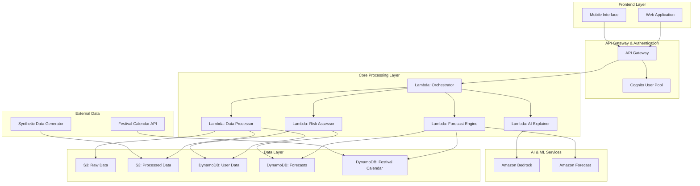

# Design Document: VyaparSaathi - Festival Demand & Inventory Risk Forecaster

## Overview

VyaparSaathi is a serverless, AI-powered demand forecasting and inventory risk assessment platform designed specifically for MSME retailers during festival seasons. The system addresses the critical challenge of inventory planning for small retailers who lack extensive historical data or data science expertise.

The platform employs a dual-mode approach: structured data analysis for retailers with historical sales records, and a low-data mode using qualitative forecasting methods combined with synthetic festival patterns for retailers with minimal data. AWS Bedrock provides natural language explanations to make complex forecasting insights accessible to non-technical users.

Key design principles:
- **Data flexibility**: Works with minimal or no historical data
- **Explainable AI**: Clear, simple explanations for all recommendations
- **Serverless scalability**: Handles festival season traffic spikes automatically
- **Cost-effective**: Pay-per-use model suitable for small businesses
- **Festival-aware**: Incorporates regional festival calendars and seasonal patterns

## Architecture

The system follows a serverless-first architecture on AWS, designed for automatic scaling during festival seasons when demand for forecasting services peaks.



### Architecture Components

**Frontend Layer**: React-based web application with mobile-responsive design, optimized for basic digital literacy users.

**API Gateway**: Centralized entry point with rate limiting, request validation, and CORS configuration.

**Authentication**: Amazon Cognito for user management with social login options to reduce friction.

**Core Processing Layer**: 
- **Orchestrator**: Coordinates workflow between components based on data availability
- **Data Processor**: Handles CSV uploads, data validation, and low-data mode questionnaires
- **Forecast Engine**: Generates demand predictions using Amazon Forecast or fallback algorithms
- **Risk Assessor**: Calculates stockout/overstock risks and generates recommendations
- **AI Explainer**: Uses Amazon Bedrock to generate natural language explanations

**Data Storage**:
- **S3**: Raw and processed sales data with lifecycle policies
- **DynamoDB**: User profiles, forecast results, and festival calendar data
- **Festival Calendar**: Pre-populated regional festival data with demand multipliers

## Components and Interfaces

### Data Input Component

**Structured Data Mode**:
```typescript
interface SalesRecord {
  date: string;           // ISO date format
  sku: string;           // Product identifier
  quantity: number;      // Units sold
  category?: string;     // Optional product category
  price?: number;        // Optional unit price
}

interface DataUpload {
  userId: string;
  file: File;           // CSV file
  format: 'csv' | 'excel';
  validation: ValidationResult;
}
```

**Low-Data Mode**:
```typescript
interface QuestionnairResponse {
  userId: string;
  businessType: 'grocery' | 'apparel' | 'electronics' | 'general';
  storeSize: 'small' | 'medium' | 'large';
  lastFestivalPerformance: {
    festival: string;
    salesIncrease: number;  // Percentage increase
    topCategories: string[];
    stockoutItems: string[];
  };
  currentInventory: InventoryEstimate[];
  targetFestivals: string[];
}

interface InventoryEstimate {
  category: string;
  currentStock: number;
  averageDailySales: number;
  confidence: 'low' | 'medium' | 'high';
}
```

### Forecasting Engine Component

**Forecast Generation**:
```typescript
interface ForecastRequest {
  userId: string;
  forecastHorizon: number;  // Days (7-14)
  targetFestivals: string[];
  dataMode: 'structured' | 'low-data';
  confidence: number;       // Minimum confidence threshold
}

interface ForecastResult {
  sku: string;
  category: string;
  predictions: DailyPrediction[];
  confidence: number;
  methodology: 'ml' | 'pattern' | 'hybrid';
  assumptions: string[];
}

interface DailyPrediction {
  date: string;
  demandForecast: number;
  lowerBound: number;
  upperBound: number;
  festivalMultiplier: number;
}
```

### Risk Assessment Component

**Risk Calculation**:
```typescript
interface RiskAssessment {
  sku: string;
  category: string;
  currentStock: number;
  stockoutRisk: {
    probability: number;
    daysUntilStockout: number;
    potentialLostSales: number;
  };
  overstockRisk: {
    probability: number;
    excessUnits: number;
    carryingCost: number;
  };
  recommendation: ReorderRecommendation;
}

interface ReorderRecommendation {
  action: 'reorder' | 'reduce' | 'maintain';
  suggestedQuantity: number;
  urgency: 'low' | 'medium' | 'high';
  reasoning: string[];
  confidence: number;
}
```

### AI Explanation Component

**Natural Language Generation**:
```typescript
interface ExplanationRequest {
  userId: string;
  context: 'forecast' | 'risk' | 'recommendation';
  data: ForecastResult | RiskAssessment;
  userQuery?: string;
  complexity: 'simple' | 'detailed';
}

interface ExplanationResponse {
  explanation: string;
  keyInsights: string[];
  assumptions: string[];
  limitations: string[];
  confidence: string;
  nextSteps: string[];
}
```

## Data Models

### User Profile
```typescript
interface UserProfile {
  userId: string;
  businessInfo: {
    name: string;
    type: BusinessType;
    location: {
      city: string;
      state: string;
      region: string;
    };
    size: StoreSize;
  };
  dataCapabilities: {
    hasHistoricalData: boolean;
    dataQuality: 'poor' | 'fair' | 'good';
    lastUpdated: string;
  };
  preferences: {
    forecastHorizon: number;
    riskTolerance: 'conservative' | 'moderate' | 'aggressive';
    notificationSettings: NotificationSettings;
  };
}
```

### Festival Calendar
```typescript
interface FestivalEvent {
  festivalId: string;
  name: string;
  date: string;
  region: string[];
  category: string;
  demandMultipliers: {
    [category: string]: number;
  };
  duration: number;  // Days
  preparationDays: number;  // Lead time needed
}
```

### Synthetic Data Model
```typescript
interface SyntheticPattern {
  businessType: BusinessType;
  region: string;
  festival: string;
  baselinePatterns: {
    category: string;
    normalDemand: number;
    festivalMultiplier: number;
    peakDays: number[];
    variance: number;
  }[];
  seasonalFactors: {
    month: number;
    factor: number;
  }[];
}
```

## Correctness Properties

*A property is a characteristic or behavior that should hold true across all valid executions of a system—essentially, a formal statement about what the system should do. Properties serve as the bridge between human-readable specifications and machine-verifiable correctness guarantees.*

Before defining the correctness properties, I need to analyze the acceptance criteria from the requirements to determine which ones are testable as properties.

### Property Reflection

After analyzing all acceptance criteria, I identified several areas where properties can be consolidated:

**Data Processing Properties**: Properties 1.1, 1.5, and 8.1 all relate to data validation and can be combined into comprehensive data handling properties.

**Forecasting Properties**: Properties 2.1, 2.2, 2.3, 2.4, and 2.5 all relate to forecast generation and can be streamlined to focus on core forecasting behaviors.

**Risk Assessment Properties**: Properties 3.1, 3.2, 3.3, 3.4, and 3.5 can be consolidated into comprehensive risk calculation properties.

**Data Management Properties**: Properties 7.2, 7.3, and 7.4 relate to data lifecycle and access control and can be combined.

**Mode Switching Properties**: Properties 1.4 and 8.5 both relate to system behavior based on data availability and can be consolidated.

### Correctness Properties

Based on the prework analysis and property reflection, here are the key correctness properties:

**Property 1: Data Validation and Processing**
*For any* uploaded sales data file, the system should successfully parse files with required fields (date, SKU, quantity) and reject files missing these fields with clear error messages
**Validates: Requirements 1.1, 1.5**

**Property 2: Low-Data Mode Forecasting**
*For any* low-data scenario with user estimates and festival context, the system should generate demand forecasts using synthetic patterns and user inputs
**Validates: Requirements 1.3, 2.5**

**Property 3: Data Source Prioritization**
*For any* forecasting request where both structured historical data and manual estimates are available, the system should prioritize structured data for forecast generation
**Validates: Requirements 1.4**

**Property 4: Festival-Aware Forecasting**
*For any* upcoming festival period, the system should generate 7-14 day demand predictions that incorporate festival calendar data and show higher demand during festival periods compared to baseline
**Validates: Requirements 2.1, 2.2**

**Property 5: Regional Festival Customization**
*For any* festival occurring in multiple regions, forecasts generated for different regions should vary based on regional festival patterns and demand multipliers
**Validates: Requirements 2.3**

**Property 6: Forecast Confidence Indicators**
*For any* generated demand forecast, the result should include confidence indicators within valid ranges (0-1 or equivalent scale)
**Validates: Requirements 2.4**

**Property 7: Risk Assessment Completeness**
*For any* SKU/category with current inventory and demand forecast, the system should calculate both stockout and overstock risks with associated probabilities
**Validates: Requirements 3.1, 3.2**

**Property 8: Risk-Based Alert Generation**
*For any* risk assessment where calculated risk exceeds predefined thresholds, the system should generate alerts with appropriate severity indicators
**Validates: Requirements 3.3**

**Property 9: Reorder Recommendations**
*For any* risk assessment indicating stockout risk, the system should provide reorder recommendations with specific suggested quantities and confidence indicators
**Validates: Requirements 3.4, 3.5**

**Property 10: Explanation Generation**
*For any* forecast or risk assessment, the system should generate explanations that include assumptions and limitations
**Validates: Requirements 4.4**

**Property 11: Performance Requirements**
*For any* valid user input, the system should generate forecasts and risk assessments within 30 seconds
**Validates: Requirements 6.1**

**Property 12: Error Handling**
*For any* system error or invalid input, the system should provide clear error messages and recovery options
**Validates: Requirements 6.5**

**Property 13: Data Lifecycle Management**
*For any* user data stored in the system, data should be automatically deleted according to retention policies and immediately upon account deletion
**Validates: Requirements 7.2, 7.3**

**Property 14: Access Control**
*For any* data access request, the system should prevent unauthorized access to user data and forecasting results
**Validates: Requirements 7.4**

**Property 15: Synthetic Data Generation**
*For any* demo mode request, the system should generate realistic synthetic sales data and festival patterns that reflect industry characteristics
**Validates: Requirements 8.1, 8.2**

**Property 16: Mode Switching**
*For any* user switching between demo and real data modes, the system should correctly apply the appropriate data sources and clearly indicate the current mode
**Validates: Requirements 8.5**

## Error Handling

The system implements comprehensive error handling across all components:

### Data Processing Errors
- **Invalid CSV Format**: Clear messages indicating specific formatting issues with examples
- **Missing Required Fields**: Detailed field validation with suggestions for correction
- **Data Quality Issues**: Warnings for suspicious data patterns with options to proceed or correct

### Forecasting Errors
- **Insufficient Data**: Graceful fallback to synthetic patterns with clear confidence indicators
- **Festival Data Unavailable**: Use of default seasonal patterns with reduced confidence
- **Model Failures**: Fallback to simpler forecasting methods with appropriate warnings

### System Errors
- **Service Timeouts**: Retry mechanisms with exponential backoff
- **Rate Limiting**: Clear messages about usage limits with retry timing
- **Authentication Failures**: Secure error messages without exposing system details

### Recovery Mechanisms
- **Automatic Retries**: For transient failures with circuit breaker patterns
- **Graceful Degradation**: Reduced functionality when services are unavailable
- **User Guidance**: Step-by-step recovery instructions for user-correctable errors

## Testing Strategy

The testing strategy employs a dual approach combining property-based testing for universal correctness properties with unit testing for specific examples and edge cases.

### Property-Based Testing
- **Framework**: Use Hypothesis (Python) or fast-check (TypeScript) for property-based testing
- **Test Configuration**: Minimum 100 iterations per property test to ensure comprehensive input coverage
- **Data Generation**: Custom generators for sales data, festival calendars, and user inputs
- **Property Validation**: Each correctness property implemented as a separate property-based test

**Property Test Examples**:
```python
# Property 1: Data Validation
@given(sales_data=sales_csv_strategy())
def test_data_validation_property(sales_data):
    """Feature: vyapar-saathi, Property 1: Data validation and processing"""
    result = process_sales_data(sales_data)
    if has_required_fields(sales_data):
        assert result.success == True
        assert result.parsed_records > 0
    else:
        assert result.success == False
        assert len(result.error_messages) > 0

# Property 4: Festival-Aware Forecasting
@given(festival_data=festival_strategy(), base_data=sales_strategy())
def test_festival_aware_forecasting(festival_data, base_data):
    """Feature: vyapar-saathi, Property 4: Festival-aware forecasting"""
    baseline_forecast = generate_forecast(base_data, festivals=[])
    festival_forecast = generate_forecast(base_data, festivals=[festival_data])
    
    # Festival periods should show higher demand
    festival_days = get_festival_period(festival_data)
    for day in festival_days:
        assert festival_forecast[day].demand >= baseline_forecast[day].demand
```

### Unit Testing
Unit tests complement property tests by focusing on:
- **Specific Examples**: Known good/bad inputs with expected outputs
- **Edge Cases**: Boundary conditions and corner cases
- **Integration Points**: Component interactions and data flow
- **Error Conditions**: Specific error scenarios and recovery paths

**Unit Test Focus Areas**:
- CSV parsing with malformed data
- Festival calendar edge cases (overlapping festivals, regional variations)
- Risk calculation boundary conditions (zero inventory, infinite demand)
- AI expla